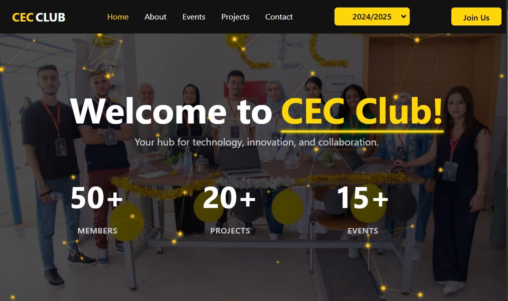

  

  &nbsp;&nbsp;&nbsp;
  NEXT.js
&nbsp;&nbsp;&nbsp;
   

---

### CEC CLUB - Computer Engineering Club

CEC CLUB is a dynamic student community dedicated to technology, innovation, and collaboration at the National School of Applied Sciences (ENSA). We serve as a hub for computer engineering students to connect, learn, and build together.

## <a name="tech-stack">⚙️ Tech Stack</a>

- Next.js
- TypeScript
- shadcn
- Tailwind CSS

🔗 **Live Demo:** [Try it here]([https://cec-website-sand.vercel.app/](https://cec-club.netlify.app/))
